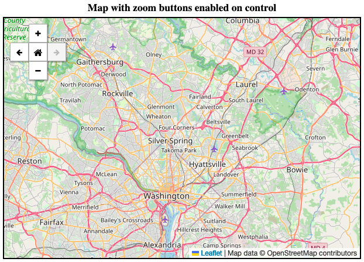
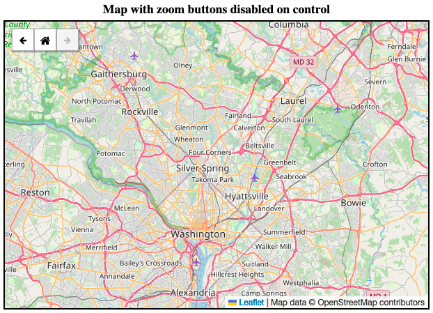

Leaflet.ZoomNavBar
==============

L.ZoomNavBar is a simple zoom and navigation plugin for Leaflet. It combines zoom functionality and view history navigation into a single, compact, easy-to-use control.

## Demo

Demo: http://cw353.github.io/Leaflet.ZoomNavBar/

  



## Details

Adapted from <a href='https://github.com/davidchouse/'>David C.</a>'s <a href='https://github.com/davidchouse/Leaflet.NavBar'>L.NavBar</a> plugin, L.ZoomNavBar combines the original plugin's view navigation features with new zoom functionality. The buttons are styled into a single, compact control to reduce the amount of space they take up on the map.

The zoom buttons on the control can be enabled or disabled as desired, depending on the use case. See the demo for examples.

## Requirements
- Leaflet 1.x
- Font Awesome 4.x
- Tested with Firefox, Google Chrome, and Safari 

## Using the Plugin

To use this plugin, first load in its dependencies (Leaflet and Font Awesome):

```
<link rel="stylesheet" href="https://unpkg.com/leaflet@1.8.0/dist/leaflet.css"/>
<script src="https://unpkg.com/leaflet@1.8.0/dist/leaflet.js"></script>
<link rel="stylesheet" href="https://cdnjs.cloudflare.com/ajax/libs/font-awesome/4.7.0/css/font-awesome.min.css"/>
```

Then load in the CSS and JS files from this repository:

```
<link rel="stylesheet" href="Leaflet.ZoomNavBar.css"/>
<script src="Leaflet.ZoomNavBar.js"></script>
```

Next, create the map. If you don't want to use Leaflet's native zoom control in addition to this plugin, set the option `zoomControl` to `false`:

````js
var map = L.map('map', {
  zoomControl: false
});
````

Finally, create and add the ZoomNavBar control:

````js
L.control.zoomNavBar().addTo(map);
````

The ZoomNavBar control has zoom buttons enabled by default. If you don't want to include the zoom buttons, simply set the `enableZoom` option to `false`:

````js
L.control.zoomNavBar({
  enableZoom: false
}).addTo(map);
````

## Options

Options for initialising the Leaflet.ZoomNavBar control:

| Option | Type | Default | Description
| --- | --- | --- | ---
| position | String | `'topleft'` | The position of the control.
| center | `L.LatLng` | Current center of map | The center point for the home view.
| zoom | Number | `0` | The zoom value for the home view.
| bbox | `L.LatLngBounds` | `null` | The bounding box for the home view (as an alternative to specifying center/zoom; takes precedence if included).
| enableZoom | Boolean | `true` | Whether or not to include zoom buttons on the control.
| forwardTitle | String | `'Go forward in map view history'` | The title text for the button used to navigate forward in map history.
| backTitle | String | `'Go back in map view history'` | The title text for the button used to navigate back in map history.
| homeTitle | String | `'Go to home map view'` | The title text for the home view button.
| zoomInTitle | String | `'Zoom in'` | The title text for the zoom in button.
| zoomOutTitle | String | `'Zoom out'` | The title text for the zoom out button.
